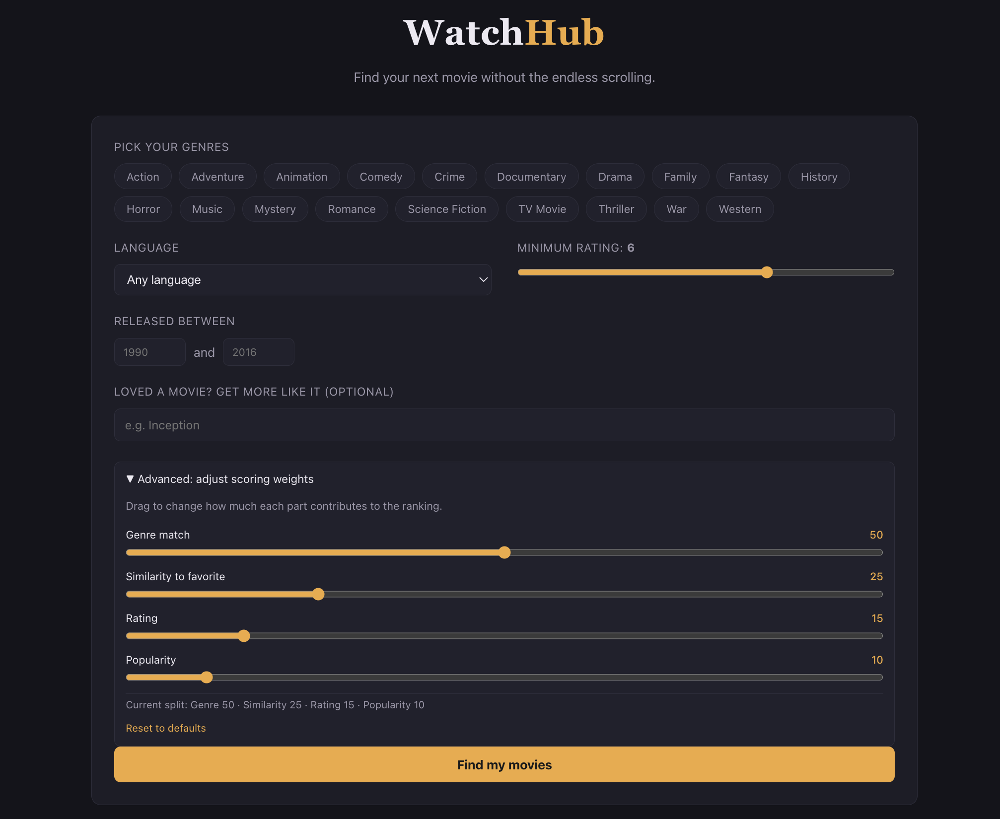
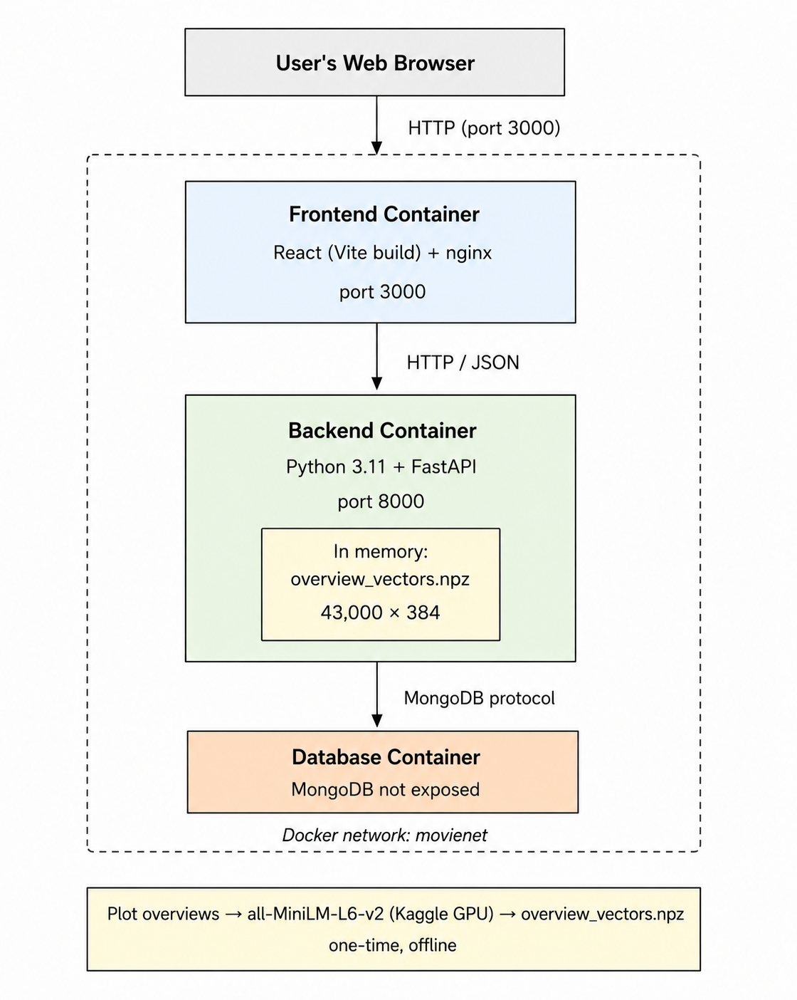
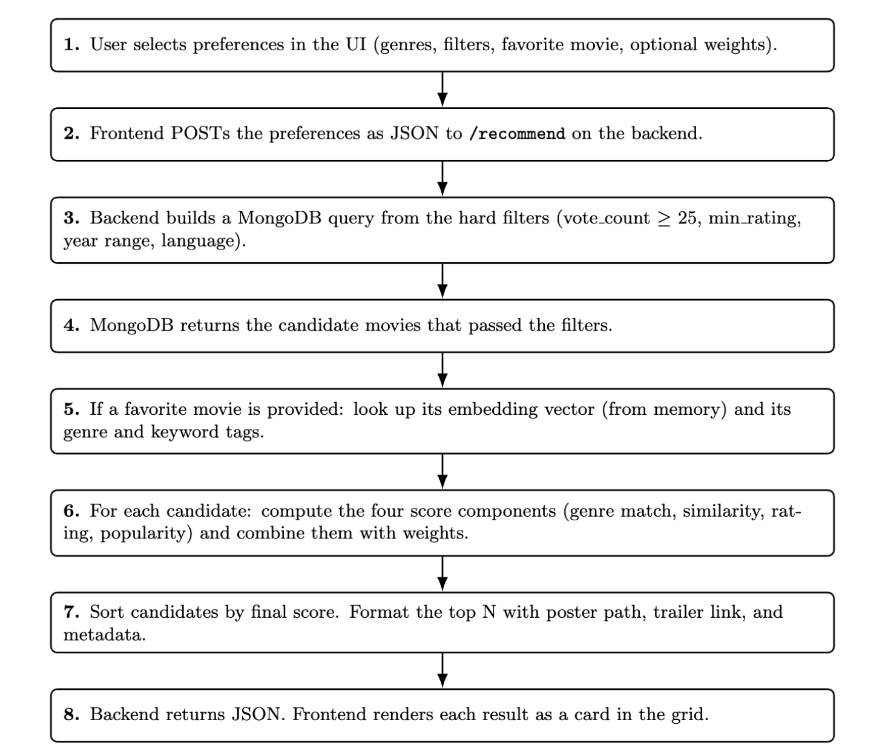

# WatchHub

Helping users discover movies without endless scrolling.

## About the Project

Finding a movie to watch should not take longer than watching the movie itself. Most recommendation platforms provide suggestions, but the logic behind those recommendations is hidden. Users rarely know why a particular movie appears at the top of the list, and they have almost no control over the recommendation process.

I built WatchHub to explore a different approach. Instead of treating the recommendation system as a black box, the application makes the ranking process transparent. Users can influence the recommendations by adjusting the importance of different factors such as genre match, movie ratings, popularity, and similarity to a favourite movie.

The application contains a multilingual catalogue of approximately 43,000 movies, interactive filtering options, adjustable recommendation weights, and runs entirely through Docker without requiring any external APIs or configuration after setup.



This README explains the project, its design decisions, and how the recommendation engine works. Additional screenshots, implementation details, backend modules, and the formulas behind each scoring component are available in [`docs/documentation.pdf`](docs/documentation.pdf).

---

## Table of Contents

- [Why I Built This Project](#why-i-built-this-project)
- [What Makes This Project Unique](#what-makes-this-project-unique)
- [Features](#features)
- [Technology Stack](#technology-stack)
- [System Architecture](#system-architecture)
- [Request Flow](#request-flow)
- [Recommendation Engine](#recommendation-engine)
- [Data Preparation](#data-preparation)
- [Docker Architecture](#docker-architecture)
- [Project Structure](#project-structure)
- [Testing](#testing)
- [Documentation](#documentation)
- [Sources and Declarations](#sources-and-declarations)
- [AI Usage](#ai-usage)
- [Future Improvements](#future-improvements)
- [Author](#author)

---

## Why I Built This Project

I enjoy watching movies, but I've often found that getting good recommendations isn't as straightforward as it should be. Most streaming platforms suggest movies based on their own algorithms, but users have no idea why those recommendations appear. If a recommendation feels irrelevant, there is no way to understand or influence the ranking.

That made me curious about how recommendation systems actually work and whether I could build one where the decision-making process is transparent.

While working on this project, I decided on a few design goals:

**Use a reliable and publicly available dataset.** I wanted to spend my time building the recommendation engine instead of collecting or scraping movie information. The TMDB dataset already contains genres, keywords, ratings, popularity, release year, and plot overviews.

**Build something that I could evaluate myself.** Since I'm familiar with movies across different genres, it was easier to judge whether the recommendations actually made sense and identify situations where the algorithm produced poor results.

**Keep the problem focused.** A movie recommendation system has a clearly defined objective, which allowed me to spend more time improving the ranking algorithm rather than solving unrelated challenges.

**Address limitations I noticed in existing platforms.** Many recommendation systems give users very little control over the ranking process, have limited multilingual support, and rarely explain why one movie is ranked above another.

Overall, the project became a combination of web development, backend engineering, database management, and basic machine learning concepts, all working together in a single application.

---

## What Makes This Project Unique

Many movie recommendation applications display a list of suggestions without explaining how those suggestions were generated. Three decisions separate WatchHub from that approach.

### Two Similarity Techniques Instead of One

Most content-based recommenders rely on a single similarity measure. WatchHub combines two, because each one alone has a blind spot.

Jaccard similarity compares structured information such as genres and keywords. It is precise, but it cannot understand a storyline — two films can share every tag and tell completely unrelated stories. Sentence embeddings compare the actual meaning of plot summaries, but on their own they can drift toward films in unrelated genres simply because the language is similar.

The clearest example of why this matters is Batman v Superman: Dawn of Justice.

**Using Only Jaccard Similarity**

| Rank | Recommended Movie |
|------|-------------------|
| 1 | Zack Snyder's Justice League |
| 2 | The Lord of the Rings: The Return of the King |
| 3 | The Lord of the Rings: The Fellowship of the Ring |
| 4 | The Lord of the Rings: The Two Towers |

These recommendations appear because the movies share genres such as Action, Adventure and Fantasy. The metadata overlaps, but the stories are completely different.

**Using Jaccard + Sentence Embeddings**

| Rank | Recommended Movie |
|------|-------------------|
| 1 | Zack Snyder's Justice League |
| 2 | The Dark Knight |
| 3 | Justice League: Warworld |
| 4 | Spider-Man: Across the Spider-Verse |

Once semantic similarity is introduced, the system considers the storyline rather than only the genre labels, and the recommendations become much closer to what a user would expect. Screenshots of both searches are in [`docs/documentation.pdf`](docs/documentation.pdf).

### The User Controls the Ranking

Recommendation platforms normally decide for the user how much ratings, popularity, or relevance should matter. WatchHub exposes those weights instead of hiding them, so a user who wants trending films and a user who wants critically acclaimed ones can get genuinely different results from the same catalogue.

This was a design goal from the beginning rather than an added feature. The scoring formula is documented, adjustable, and visible in the interface.

### A Multilingual Catalogue

Most tutorial-style movie recommenders cover English-language films only. WatchHub uses a dataset spanning many languages, so a user searching in Hindi, Tamil, Japanese, or French is served by the same engine as one searching in English.

---

## Features

- **Content-based recommendations** from a catalogue of approximately 43,000 movies, with no account or watch history required.
- **Favourite movie search** — name a film you like and receive recommendations with similar themes and storylines.
- **Adjustable ranking weights** for genre match, favourite movie similarity, rating, and popularity.
- **Filtering** by genre, minimum rating, release year, and original language.
- **Multilingual catalogue** with a language filter.
- **Movie details on every card** — poster, rating, genres, release year, expandable overview, and a trailer link.
- **Clean interface** — frequently used controls remain visible, while advanced options stay collapsed until needed.
- **Single-command deployment** — the frontend, backend, and database all run inside Docker containers.

---

## Technology Stack

**Frontend** — React, JavaScript (ES6), Vite, HTML, CSS, Nginx

React renders the interface and displays results. Vite generates the optimized production build, which Nginx serves as static files inside the container. No recommendation logic runs on the client side.

**Backend** — Python 3.11, FastAPI, Uvicorn, Pydantic, NumPy

FastAPI exposes the REST APIs that receive user preferences, fetch candidate movies, calculate scores, and return ranked results. It was chosen for its simplicity, performance, automatic API documentation, and built-in request validation through Pydantic.

**Database** — MongoDB, PyMongo

Since each movie contains array-shaped fields such as genres and keywords, MongoDB's document structure fits naturally without requiring multiple relational tables.

**Machine Learning** — sentence-transformers, all-MiniLM-L6-v2, NumPy

**Deployment** — Docker, Docker Compose

---

## System Architecture

The application follows a three-tier architecture consisting of a frontend, backend, and database. All recommendation logic is handled by the backend; the frontend only collects user inputs and displays results.



**Frontend** — A React single-page application served through Nginx on port 3000. It displays the recommendation form, collects user preferences, and renders results with posters and trailer links.

**Backend** — The core of the application, running on port 8000. It validates the request, retrieves candidate movies from MongoDB, loads the required embedding vectors, calculates similarity scores, applies the weighted ranking algorithm, and returns the highest-ranked movies.

**Database** — MongoDB stores approximately 43,000 movie documents containing title, genres, keywords, overview, rating, popularity, release year, original language, and poster path. Indexes on movie title and language improve query performance.

**Offline Embedding Pipeline** — Generating sentence embeddings is the most computationally expensive part of the project, so it is performed only once rather than at runtime. The all-MiniLM-L6-v2 model converts each movie overview into a 384-dimensional vector on a Kaggle GPU, and the vectors are stored in a compressed `.npz` file that ships with the repository. The backend loads them into memory at startup, so recommendation requests compare existing vectors instead of generating new ones. The model itself is never present in the running container.

---

## Request Flow

The frontend collects the user's preferences, the backend processes them, and MongoDB provides the movie data required for ranking.



Each request involves only database queries, vector comparisons, and score calculations, allowing results to be returned within milliseconds.

---

## Recommendation Engine

Instead of relying on a single metric, the system evaluates every candidate movie using four factors, then combines them into one final ranking score.

```
Final Score =
      0.50 × Genre Match
    + 0.25 × Favourite Movie Similarity
    + 0.15 × Rating
    + 0.10 × Popularity
```

Each component is normalized between 0 and 1, making it possible to combine them fairly without one factor dominating the others.

### 1. Genre Match (50%)

Genre matching carries the highest weight because it directly reflects what the user has requested.

Rather than comparing every genre attached to a movie, the system checks how many of the user's selected genres are present in that movie. If a user selects Action and Comedy, and a movie is tagged Action and Drama, one of the two requested genres matches:

```
Genre Score = 1 / 2 = 0.5
```

This focuses on satisfying the user's preferences instead of penalising movies simply because they belong to additional genres.

### 2. Favourite Movie Similarity (25%)

Used only when the user enters a favourite movie. This is where the two similarity techniques are combined:

```
Similarity =
      0.70 × Cosine Similarity
    + 0.30 × Jaccard Similarity
```

The cosine term compares the 384-dimensional embeddings of the two plot overviews, measuring how closely the stories are related. The Jaccard term measures the overlap of genres and keywords.

Cosine similarity contributes most of the semantic understanding, while Jaccard prevents recommendations from drifting too far away from the original movie. If embedding vectors are unavailable for any movie, the backend automatically falls back to Jaccard similarity so recommendations can still be generated.

### 3. Rating Score (15%)

Highly rated movies generally provide a better viewing experience, but ratings alone should not determine recommendations. TMDB ratings are divided by 10 to keep them proportional to the other components, so a rating of 8.4 becomes 0.84.

### 4. Popularity Score (10%)

Popularity values vary significantly — some blockbusters have values several hundred times larger than ordinary movies. Using raw values would cause popularity to dominate the recommendation process, so the value is transformed using logarithmic scaling before being normalized. This reduces the influence of extremely popular movies while still rewarding films that are generally well known.

### Filters vs Ranking Weights

One important design decision was separating filtering from ranking.

**Filtering** determines which movies are eligible to be recommended — minimum rating, language, release year, and genres. Movies that do not satisfy these requirements are removed before scoring begins.

**Ranking weights** only decide how the remaining movies are ordered.

For example, a user may require a minimum rating of 7 while assigning the rating weight to 0. Movies rated below 7 are still excluded, but rating no longer affects the ordering of the remaining movies. Separating the two gives users much greater control over the recommendation process.

---

## Data Preparation

### Choosing the Dataset

The project did not begin with the dataset it uses now. My first approach was to merge two separate sources in order to get multilingual coverage, but this created three problems: the popularity values used different scales, the genre names did not match between sources, and one dataset was missing plot overviews entirely.

I built workarounds for each of these, but once a single multilingual dataset with consistent fields became available, switching to it solved all three problems at the source.

### Dataset Filtering

The original TMDB dataset contains well over a million records, many of them incomplete or with very few user votes. Only movies satisfying the following conditions were retained:

- At least 25 user votes
- Non-empty genres
- Non-empty plot overview
- Non-adult content

This reduced the dataset to approximately 43,000 high-quality movies suitable for recommendation.

### Data Cleaning

Before storing the movies, additional preprocessing was carried out:

- Splitting comma-separated genres and keywords into lists
- Extracting the release year from the release date
- Converting numeric values safely
- Removing incomplete records
- Standardising missing values

These steps ensured that every movie document followed a consistent structure inside MongoDB.

### Generating Embeddings

Once the dataset was cleaned, all movie overviews were converted into sentence embeddings on a Kaggle GPU and stored in a compressed `.npz` file. Performing this offline rather than at runtime significantly improves response times without affecting recommendation quality.

---

## Docker Architecture

The entire project is containerised. Instead of installing the frontend, backend, and database separately, everything starts together through Docker Compose as three containers connected by a private Docker network.

**Frontend Container** — A multi-stage build: the React project is first built using Node.js, then only the production build is copied into the final Nginx image, so development dependencies are excluded and the image stays smaller.

**Backend Container** — During the build, Python dependencies are installed and both the cleaned dataset and the precomputed embedding vectors are copied into the image. On startup the container connects to MongoDB, seeds the database if required, loads the embedding vectors into memory, and starts the server.

**MongoDB Container** — For security, the database has no port mapping and is not exposed outside the Docker network. Only the backend container can reach it, using Docker's internal networking.

### Running the Project

Once Docker Desktop is installed, the complete application can be started with a single command.

```
docker compose up --build
```

Docker automatically creates the required network, builds the images, starts all three containers, and connects them together. No additional software installation or manual database configuration is required.

Detailed setup instructions are available in [`INSTALL.md`](INSTALL.md).

---

## Project Structure

```
Recommendation_System/
│
├── backend/
│   ├── app/
│   │   ├── cleaning.py
│   │   ├── config.py
│   │   ├── database.py
│   │   ├── main.py
│   │   ├── recommender.py
│   │   ├── scoring.py
│   │   ├── seed.py
│   │   ├── vectors.py
│   │   └── routers/
│   │
│   ├── data/
│   │   ├── tmdb_movies_clean.csv
│   │   └── overview_vectors.npz
│   │
│   ├── Dockerfile
│   └── requirements.txt
│
├── frontend/
│   ├── src/
│   ├── Dockerfile
│   └── package.json
│
├── docs/
│   ├── documentation.pdf
│   └── screenshots/
│
├── docker-compose.yml
├── INSTALL.md
├── USER_MANUAL.md
└── README.md
```

The frontend handles user interaction, the backend performs recommendation logic, MongoDB stores movie data, and the documentation folder contains additional reports and screenshots.

---

## Testing

The project was tested throughout development instead of waiting until the end.

**Fresh Installation Testing** — The repository was cloned on both Windows and macOS to verify that a new user could successfully run the project by following only the installation guide. This helped identify setup issues early and confirmed that Docker was the only required dependency.

**API Testing** — Before connecting the frontend, every backend endpoint was tested using FastAPI's interactive documentation. This made it easier to verify request validation, recommendation results, and response formats independently from the user interface.

**Recommendation Evaluation** — Recommendation systems do not always have one correct output, so recommendations were manually evaluated using movies I was already familiar with. This process identified situations where genre matching alone produced unrealistic recommendations, eventually leading to the introduction of sentence embeddings.

**Weight Verification** — Different combinations of ranking weights were tested to confirm each scoring component behaved as expected. Increasing popularity produced newer blockbuster movies, increasing rating prioritised critically acclaimed films, and removing favourite movie similarity relied entirely on genre matching.

**Current Limitations** — Testing is primarily manual. Automated unit tests for the scoring functions and integration tests for the API would be valuable improvements in future versions.

---

## Documentation

| File | Description |
|------|-------------|
| [`INSTALL.md`](INSTALL.md) | Installation and setup instructions |
| [`USER_MANUAL.md`](USER_MANUAL.md) | Guide explaining how to use the application |
| [`docs/documentation.pdf`](docs/documentation.pdf) | Detailed project report including architecture diagrams, backend module breakdown, the scoring formulas, implementation details, and additional screenshots |

---

## Sources and Declarations

**Movie data** — The recommendation engine uses the [TMDB Movies Dataset](https://www.kaggle.com/datasets/asaniczka/tmdb-movies-dataset-2023-930k-movies) by asaniczka on Kaggle, originally sourced from [The Movie Database (TMDB)](https://www.themoviedb.org/). Attribution to TMDB is required by their terms of use. Only cleaned movie information is stored locally.

**Movie posters** — Retrieved directly from TMDB's image server at display time. Only the short poster path is stored in the database.

**Sentence embedding model** — [all-MiniLM-L6-v2](https://huggingface.co/sentence-transformers/all-MiniLM-L6-v2) from the sentence-transformers library, used offline during preprocessing. It is not a runtime dependency.

**Frameworks and libraries** — React, Vite, FastAPI, Pydantic, Uvicorn, MongoDB, PyMongo, NumPy, Docker, and Docker Compose, all open source under standard permissive licenses.

---

## AI Usage

As permitted by the project brief, AI assistants (Claude and Gemini) were used during development as learning and productivity aids.

Their uses included:

- **Understanding unfamiliar concepts before implementation.** Final decisions on the project's direction were mine.
- **Repetitive frontend work such as CSS**, where the goal was clear but the manual effort would have been disproportionate.
- **Debugging specific errors**: sharing the error and the relevant code, understanding why it was occurring, and then applying the fix.

---

## Future Improvements

The current system is content-based: it recommends movies using attributes of the movies themselves. This is a deliberate foundation, and there are several directions in which it can be expanded.

**Strengthening the recommender**

- Including cast members and directors as additional similarity features.
- Displaying official trailers directly inside the application using TMDB's video endpoint.
- Automatically updating the movie catalogue whenever new TMDB data becomes available.

**Towards a hybrid recommendation system**

- Content-based matching can only recommend what resembles what a user already likes. Collaborative filtering learns from behaviour across users and surfaces films that stated preferences would never reach. Combining both is the standard architecture for a mature recommender.
- This requires user accounts and watch history, since without behavioural data there is nothing for collaborative filtering to learn from.
- The existing engine solves the cold-start problem: it works with zero history, so it would carry new users until enough signal accumulates, becoming the fallback layer of the hybrid system.

**Expanding the platform**

- Allowing users to save favourite movies and recommendation history.
- Supporting TV series and anime alongside movies. The metadata shape is the same, so the scoring engine transfers, but the unit of recommendation is different — a long-running series is a different commitment from a two-hour film.
- Evaluating recommendation quality using offline metrics such as Precision@K and Recall@K, so that improvements can be measured rather than judged by inspection.

---

## Author

**Akash Sihag**
Roll No. 20
Technical Project Submission