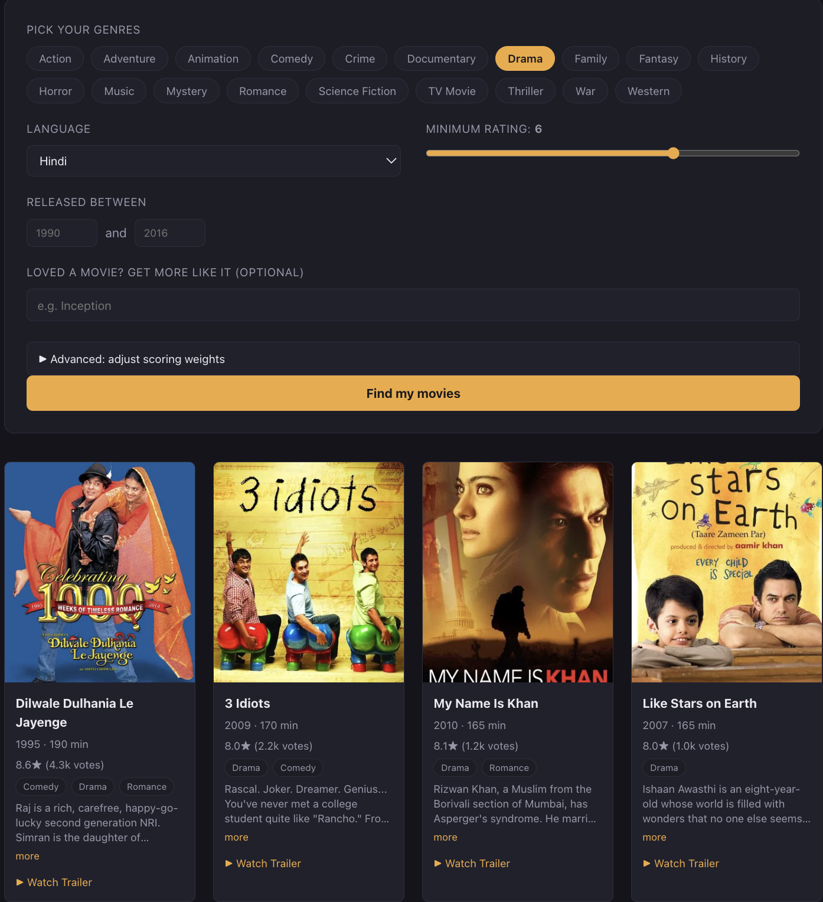
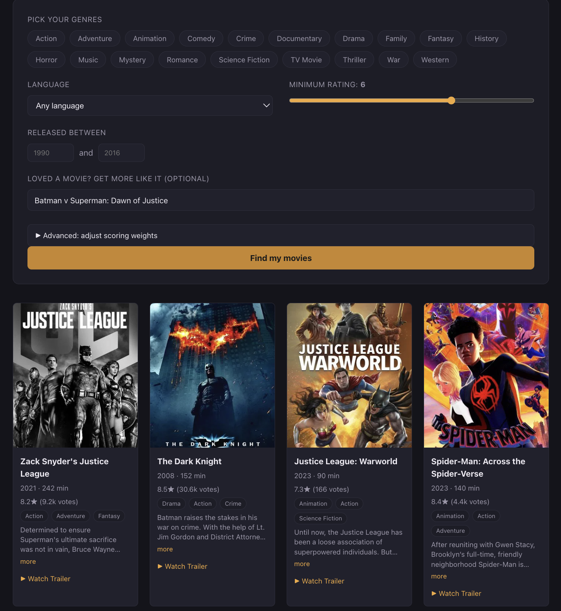
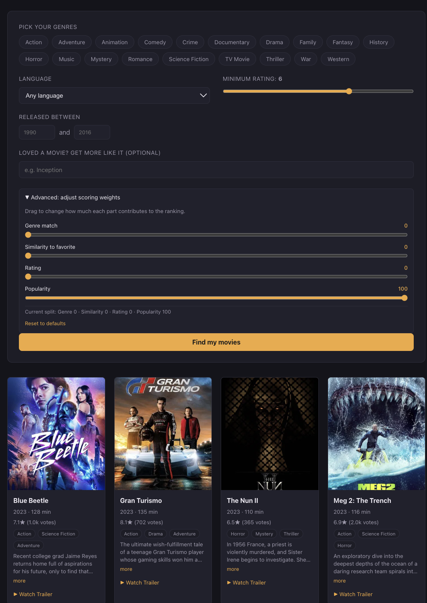

# User Manual

## 3. Using the Application

### 3.1 Overview of the Interface

Once the app is running, the interface has three main areas:

- A **search form** at the top with filters and an optional favorite movie field.
- An **Advanced panel** (collapsible) that exposes the four scoring weight sliders.
- A **results grid** below that displays matching movies as cards.

*Figure 1: The full search form with the Advanced panel expanded.*

---

### 3.2 Running a Basic Search

The default flow uses three filters:

- **Genres** — Click one or more genre chips. Multiple selections are allowed. If none are selected, all genres are considered.
- **Language** — A dropdown that limits results to one language (for example, Hindi). "Any language" removes the filter.
- **Minimum rating** — A slider that sets the lowest acceptable rating (0 to 10).

Click **Find my movies** to run the search.

*Figure 2: A basic search with Drama selected and Language set to Hindi.*

---

### 3.3 Reading a Result Card

Each card contains:

- The movie poster.
- The title.
- Year and runtime.
- Rating with vote count.
- A short overview that expands via a "more" link.
- A list of genres.
- A **"Watch Trailer"** link that opens a YouTube search in a new tab.

Hovering the mouse over a card produces a subtle 3D tilt effect.

*Figure 3: A single result card with the overview expanded.*

---

### 3.4 Finding Movies Similar to a Favorite

- Type the movie's title into the **"Favorite movie"** field before searching.
- The recommender ranks results by how closely each candidate matches the plot and tags of the favorite.

*Figure 4: Results blended around a favorite movie selection.*

---

### 3.5 Adjusting Scoring Weights (Advanced)

- Clicking **Advanced: adjust scoring weights** opens the panel.
- Four sliders appear: **Genre match**, **Similarity to favorite**, **Rating**, **Popularity**.
- The default balance is **50 / 25 / 15 / 10**.
- Users can shift the balance freely. For example:
  - Setting **Popularity** to 90 produces a "most trending movies" view.
  - Setting **Rating** to 80 surfaces critical favorites.
- A **"Reset to defaults"** button restores the original balance.

*Figure 5: Scoring weights adjusted with Popularity maximized.*

---

WatchHub — Akash Sihag, Roll No. 20
